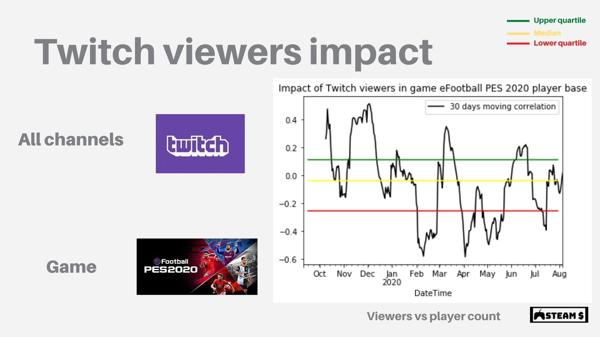
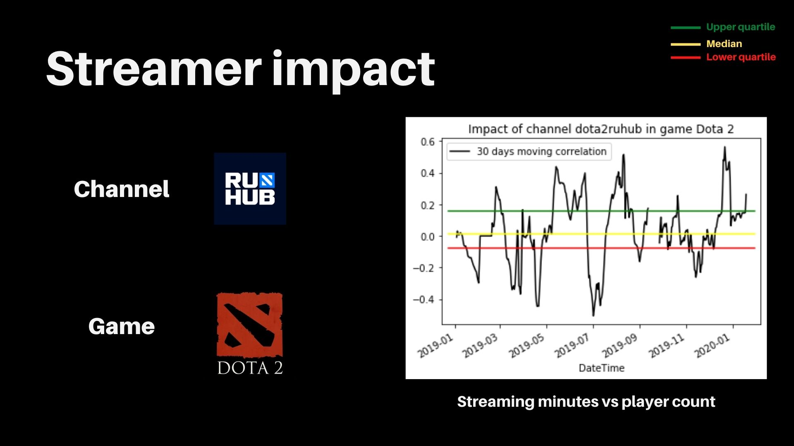
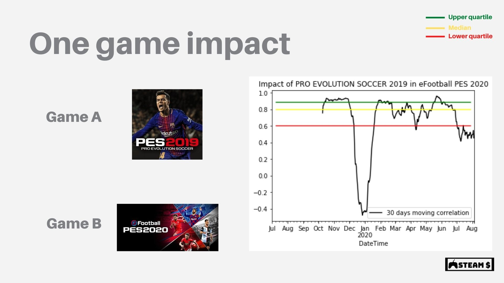

# Steam_games_statistical_project

### Date created
August 2020

### Project Title
Steam$

### Description
Statistical project with the goal of understanding the several possible reasons that can impact one game's player base.

### Check if Twitch viewers are having an impact on a game player count

### Check if a Twitch streamer is having an impact on a game player count

### Check if one game player base is having an impact on other game player count

### How to run it
1. Start a terminal
2. Clone this repo
3. Enter repo folder
4. TBD
